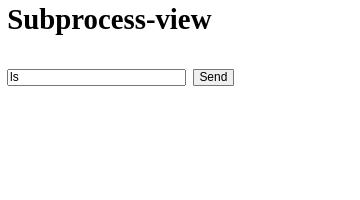
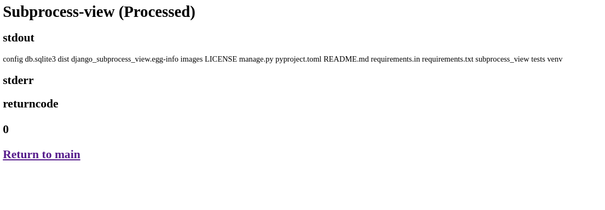

# django-subprocess-view
An app for a superuser to run subprocess commands in a Django project


## Set up


1. Install from PyPI
```
python -m pip install django-subprocess-view
```

1. Add the package to your settins INSTALLED_APPS

```python

INSTALLED_APPS = [
    ...
    "subprocess_view",
    ...
]

```
3. Add to _urls.py_

```python
urlpatterns = [
    path("admin/", admin.site.urls),
    path("subprocess/", include("subprocess_view.urls")), # add this
]


```


## Usage

1. Go to the url path or the app
2. Enter the command you wish to run

3. click _Send_
4. Check the results

